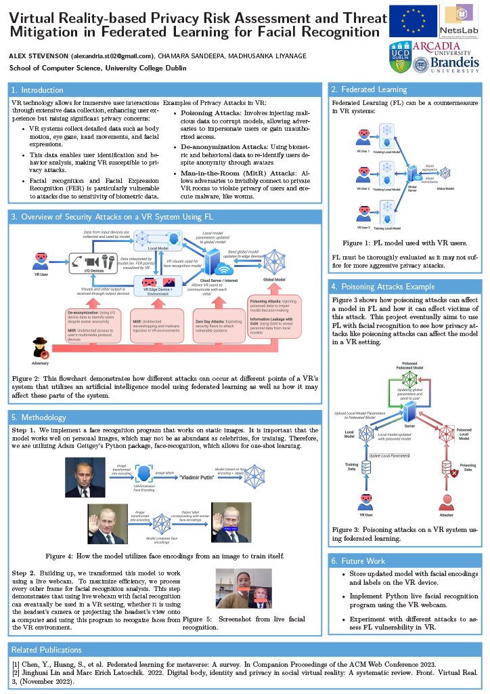

# Facial Recognition System

This repository contains Jupyter notebooks implementing a real-time facial recognition system using [Adam Geitgey's face-recognition library](https://github.com/ageitgey/face_recognition) along with adversarial poisoning experiments. The project demonstrates how to encode, store, load, and recognize faces, and explores how facial recognition models can be attacked and manipulated.

---

## Project Structure

### **face_recognition**

* **`livefacialrecognition.ipynb`**
  Runs real-time facial recognition from a live video stream (e.g., webcam).
  Detects faces, compares them against known encodings, and displays results.

* **`load_encodings.ipynb`**
  Loads previously stored facial encodings into memory for recognition tasks.
  Useful for reusing data across multiple sessions.

* **`save_encodings.ipynb`**
  Generates and saves face encodings for known individuals.
  Encodings are stored in a format suitable for later retrieval.

---

### **poisoning**

* **`poisoning_attack_static.ipynb`**
  Demonstrates how to perturb and poison stored face encodings.

  * Loads existing encodings from the `face_recognition` folder.
  * Slightly modifies (perturbs) facial encodings to simulate adversarial attacks.
  * Re-saves these poisoned encodings and shows how they can cause misclassification.
  * Provides visualization of how poisoned encodings affect recognition results.

This section highlights the **vulnerabilities of facial recognition systems to data poisoning attacks** and underscores the need for robust, privacy-preserving methods.

---

## Features

* Real-time facial recognition using OpenCV.
* Face encoding and comparison with high accuracy.
* Save and load functionality for encoding persistence.
* Modular notebooks for clear separation between **data preparation**, **real-time recognition**, and **adversarial experiments**.
* Example of a **poisoning attack** that demonstrates security concerns in biometric systems.

---

## Installation & Setup

1. Clone the repository:

   ```bash
   git clone https://github.com/alexstvn/ucd_research_facialrecognition.git
   ```

2. Install dependencies (recommended: use a virtual environment):

   ```bash
   pip install -r requirements.txt
   ```

3. Run Jupyter Notebook:

   ```bash
   jupyter notebook
   ```

---

## Usage

1. Use `save_encodings.ipynb` to generate and store encodings of known individuals.
2. Use `load_encodings.ipynb` to reload encodings when starting a new session.
3. Run `livefacialrecognition.ipynb` to test real-time recognition with a live camera.
4. Explore `poisoning_attack_static.ipynb` to study adversarial modifications and their impact.

---

## Research Context

This repository is part of my research experience in **privacy, security, adversarial machine learning, and real-time facial recognition** as part of my research abroad program at University College Dublin in Ireland. The overall scope of the project was in researching federated learning to mitigate privacy-related attacks in virtual reality systems, particularly in facial recognition. My primary task was to experiement with different facial recognition technologies in a live webcam setting and to demonstrate how poisoning works in that context.

In the attached links, you can find further documentation relating to my research:

* **Research Reports**: [Literature Review](papers/StevensonLitReview_VR_basedPrivacyRiskAssessmentInFLforFR.pdf) and [Final Report](papers/StevensonFinalReport_VR_basedPrivacyRiskAssessmentInFLforFR.pdf)

* **Research Poster Presentation** [View my Research Poster (PDF)](poster/StevensonPosterPresentation_VR_basedPrivacyRiskAssessmentInFLforFR.pdf)


---

## Future Work

* Improve recognition speed and efficiency for large datasets.
* Explore privacy-preserving approaches such as federated learning.
* Investigate adversarial robustness and secure encoding storage.
* Enhance robustness under varying lighting and camera conditions.
* Implement in a virtual-reality system.
